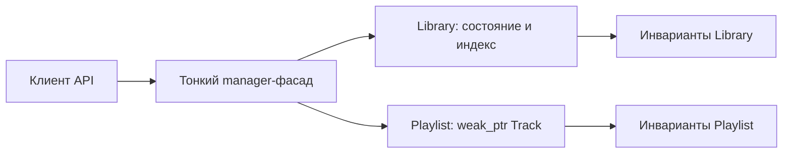

# ADR: решение для первого рабочего сценария

Файл ведёт OpenCode. Обсудите с агентом содержание и проверьте предложенный
diff. Все дополнения и исправления поручайте агенту в чате.

- Статус: accepted, TO BE
- Дата: 2026-09-14
- Ответственные: автор и владелец `music-library-manager`

## Контекст

В AS IS `Library` выдаёт mutable-ссылки на хранилище и индекс, а `Playlist` -
на своё хранилище. Это позволяет изменить состояние в обход доменных операций.
При этом библиотека хранит `std::shared_ptr<Track>`, а плейлист -
`std::weak_ptr<Track>`.

## Решение

TO BE: доменные объекты сами владеют состоянием и инвариантами. Контейнеры
`Library` и `Playlist` скрыты, публичных mutable-геттеров нет. `Library`
добавляет, ищет и удаляет треки, одновременно поддерживая индекс. `Playlist`
добавляет не-владеющую ссылку только на непустой `shared_ptr<Track>`.
Менеджеры не получают mutable-доступ к контейнерам и остаются фасадами там,
где координируют доменные операции.

TO BE-контракт: неизвестное имя даёт пустой `shared_ptr`, удаление неизвестного
имени возвращает `false`, повторяющееся имя трека или плейлиста отклоняется.
Уникальность имени трека - новое проектное решение TO BE: в AS IS индекс
`std::unordered_map<std::string, std::vector<std::size_t>>` допускает несколько
позиций для одного имени и не подтверждает это правило.
Целевые сигнатуры: `Library::addTrack(...) -> bool`,
`Library::getTrack(const std::string& name) -> shared_ptr<Track>`,
`Library::deleteTrack(const std::string& name) -> bool`,
`PlaylistManager::createPlaylist(const std::string& name) -> bool` и
`Playlist::addTrack(std::shared_ptr<Track> track) -> bool`. Это предлагаемые TO BE API,
а не сигнатуры из текущих заголовков. `addTrack(...)` принимает данные,
достаточные для добавления трека, а конкретная сигнатура уточняется после
согласования структуры `Track`.

## Рассмотренные альтернативы

| Альтернатива | Почему не выбрали сейчас |
|---|---|
| Оставить прямой mutable-доступ | Сохраняет возможность обхода инвариантов и риск рассогласования данных с индексом. |
| Оставить всю логику в manager | Менеджер становится владельцем базовых инвариантов чужого состояния. |
| Перенести инварианты в доменные объекты | Выбрано: объект, владеющий состоянием, контролирует его изменение. |

## Последствия и главный риск

- Положительные последствия: один владелец инвариантов, узкая поверхность API,
  предсказуемые граничные результаты.
- Ограничения: это целевой контракт, реализация остаётся вне данного среза.
- Главный риск: рефакторинг может сломать существующих клиентов mutable API.
- Как проверим риск: компиляционные и контрактные тесты новой публичной
  поверхности, отдельная миграция клиентов при наличии исходного кода.

## Архитектурная схема

## Как использовали AI

- Для чего: принять TO BE-границу ответственности и контракты API.
- Тип промпта: структурированный промпт с ограниченным контекстом.
- Строка в [`prompts.md`](prompts.md): P1-03.
- Что проверил студент и какие исправления поручил агенту: AS IS не получил предполагаемой реализации,
  а новые правила явно помечены как TO BE.
