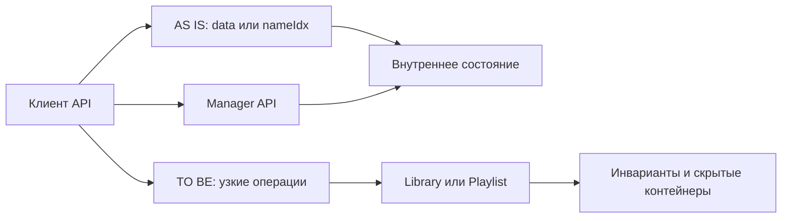

# Анализ процесса: AS IS и TO BE

## AS IS

Клиент имеет два параллельных пути изменения состояния.

1. Контролируемый путь: вызвать `LibraryManager` или `PlaylistManager`.
2. Прямой путь: получить `Library::data()`, `Library::nameIdx()` или
   `Playlist::data()` и изменить контейнер напрямую.

Второй путь обходит менеджеры и не содержит видимой точки, которая обязана
сохранить согласованность контейнера библиотеки с индексом. Кроме того,
`PlaylistManager::addTrackToPlaylists()` и `insertToPlaylist()` не имеют в
объявлении явных аргументов, а граничные результаты части операций не заданы.

## TO BE

Предлагаемое TO BE-решение: `Library` и `Playlist` скрывают контейнеры и сами
поддерживают инварианты. Наружу доступны узкие операции: добавить трек,
получить трек по имени, удалить трек, создать плейлист и добавить в него
не-владеющую ссылку на существующий трек. `LibraryManager` и
`PlaylistManager` остаются фасадами только для координации таких операций.

Предлагаемый контракт: поиск отсутствующего имени возвращает пустой
`std::shared_ptr<Track>`, удаление возвращает `false`. Добавление в плейлист
принимает явный `std::shared_ptr<Track>` и хранит `std::weak_ptr<Track>`.

## Разница

| Что меняется | AS IS | TO BE | Как проверим изменение |
|---|---|---|---|
| Доступ к состоянию | Mutable-ссылки позволяют менять контейнеры напрямую | Контейнеры скрыты, публичных mutable-геттеров нет | Проверка публичных сигнатур |
| Инварианты библиотеки | Нет видимой единой точки согласования `data_` и `name_to_idx_` | `Library` меняет данные и индекс атомарно в доменных операциях | Unit-тесты после add и remove |
| Контракты операций | Часть сигнатур и граничных случаев неоднозначна | Входы и результаты явно заданы TO BE | Product-артефакт и контрактные тесты |

## Как использовали AI

- Для чего: разложить наблюдаемый API-процесс на AS IS и минимальный TO BE.
- Тип промпта: структурированный промпт с ограниченным контекстом.
- Строка в [`prompts.md`](prompts.md): P1-03.
- Что проверили и исправили сами: не присвоили методам `PlaylistManager`
  отсутствующую в заголовках семантику.
