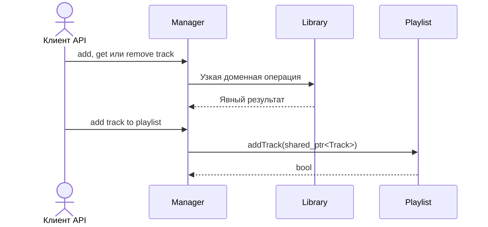

# Use cases и user stories

Файл ведёт OpenCode. Обсудите с агентом содержание и проверьте предложенный
diff. Все дополнения и исправления поручайте агенту в чате.

## Первый рабочий сценарий

**Когда** клиент публичного API изменяет библиотеку или плейлист, **система**
выполняет узкую доменную операцию, **а пользователь получает** предсказуемый
результат без прямого доступа к внутренним контейнерам.

Не входит в этот сценарий:

- UI или CLI.
- Формат хранения данных.
- Конкретная реализация `.cpp`.

## Use case

| Поле | Значение |
|---|---|
| Актор | Клиент публичного C++ API |
| Триггер | Нужно добавить, найти или удалить трек, либо изменить плейлист |
| Предусловия | Экземпляры `Library` и `Playlist` созданы. В TO BE контейнеры не выдаются наружу для изменения. |
| Основной результат | Операция меняет состояние через доменный объект и сохраняет его инварианты. |
| Ошибка или отказ | В TO BE поиск отсутствующего имени возвращает пустой `shared_ptr`, удаление отсутствующего имени возвращает `false`, добавление пустой ссылки в плейлист отклоняется. |



## User stories и acceptance criteria

```gherkin
Feature:
  Целевой API библиотеки и плейлиста

  Scenario: Добавление и поиск трека
    Given библиотека не содержит тестовый трек
    When клиент добавляет трек через доменную операцию и ищет его по имени
    Then размер библиотеки увеличен и поиск возвращает этот трек

  Scenario: Удаление и граничный результат
    Given библиотека содержит тестовый трек
    When клиент удаляет трек, а затем ищет или удаляет его повторно
    Then поиск возвращает пустой shared_ptr, а повторное удаление возвращает false
```

### Целевые use cases и acceptance criteria

| Use case | Happy path | Edge or error case | Acceptance criteria |
|---|---|---|---|
| Добавить трек | Клиент вызывает `Library::addTrack` или фасад менеджера | Повторяющееся имя обрабатывается по принятому правилу TO BE: добавление отклоняется | Размер и индекс изменяются согласованно, mutable-геттер отсутствует |
| Получить трек по имени | Известное имя возвращает `shared_ptr<Track>` | Неизвестное имя возвращает пустой `shared_ptr` | Результат определён для обоих входов |
| Удалить трек | Известный трек удаляется | Неизвестное имя возвращает `false` | Размер и индекс согласованы после удаления |
| Создать плейлист | Клиент вызывает операцию с явным именем | Повторное имя плейлиста отклоняется в TO BE | Созданный плейлист доступен через доменную операцию |
| Добавить трек в плейлист | Передан существующий `shared_ptr<Track>` | Пустой `shared_ptr` отклоняется | Плейлист хранит `weak_ptr` и не владеет треком |

## Как использовали AI

- Для чего: задать use cases целевого инкапсулированного API.
- Тип промпта: структурированный промпт с ограниченным контекстом.
- Строка в [`prompts.md`](prompts.md): P1-03.
- Что проверил студент и какие исправления поручил агенту: результаты ошибок и повторяющихся имён явно
  помечены как предлагаемый TO BE-контракт.
