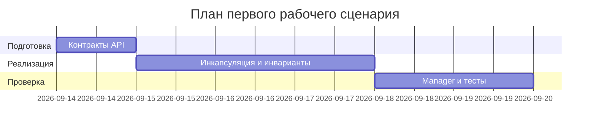

# План поставки

Файл ведёт OpenCode. Обсудите с агентом содержание и проверьте предложенный
diff. Все дополнения и исправления поручайте агенту в чате.

## Инкременты и ответственность

| Инкремент | Наблюдаемый результат | Что делает человек | Что делает AI или субагент | Проверка | Зависимости |
|---|---|---|---|---|---|
| 1 | Приняты TO BE-контракты add, get, remove и операций плейлиста | Утверждает входы, результаты и правила повторов | Проверяет полноту и трассировку контрактов | Ревью use cases | `problem.md`, `analysis.md` |
| 2 | В публичных моделях нет mutable-геттеров контейнеров | Реализует и ревьюит закрытие `data()` и `nameIdx()` | Ищет обходные пути и сверяет API | Проверка публичных заголовков | Инкремент 1 |
| 3 | `Library` и `Playlist` поддерживают свои инварианты | Реализует доменные операции | Предлагает unit-кейсы и анализирует покрытие | Unit-тесты add, get, remove и weak_ptr | Инкремент 2 |
| 4 | Менеджеры используют доменные операции как фасады | Уточняет сигнатуры менеджеров и убирает дублирование | Сверяет ответственность с ADR | Integration-тесты manager + domain | Инкремент 3 |
| 5 | Контрактные unit и integration проверки готовы | Утверждает тестовые входы и ревьюит результаты | Формирует матрицу трассировки | Выполнение тестового набора | Инкремент 4 |
| 6 | Учебные load и E2E сценарии готовы | Подтверждает тестовые допущения | Помогает сформировать сценарии | Выполнение сценариев после реализации | Инкремент 5 |

## Диаграмма Ганта

Даты - учебное допущение для относительного плана, а не календарное требование
проекта.

## Как использовали AI

- Для чего: разложить переход к инкапсулированному API на поставляемые шаги.
- Тип промпта: структурированный промпт с ограниченным контекстом.
- Строка в [`prompts.md`](prompts.md): P1-03.
- Что проверил студент и какие исправления поручил агенту: инкременты зависят от принятия контракта,
  а числовые сроки отмечены как учебное допущение.
